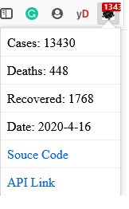

# Covid-19 India Tracker

Track Covid-19 cases in India from Chrome extensions

## Example

## Data source

The project is using the [pomber covid time series-api](https://pomber.github.io/covid19/timeseries.json).

## Installing

This extension is currently approved by firefox and under review by the Chrome Web Store. Meanwhile, you can install it following the steps below:

For firefox:
https://addons.mozilla.org/addon/covidtracker/

For chrome:
- [Download](https://github.com/emersonlaurentino/covid-19braziltracker/archive/master.zip) our source code
- Unzip the downloaded folder
- In Chrome, access the [Extensions](chrome://extensions) page and toggle **Developer Mode** on
- Click on the button **Load unpacked** and select the unzipped folder
